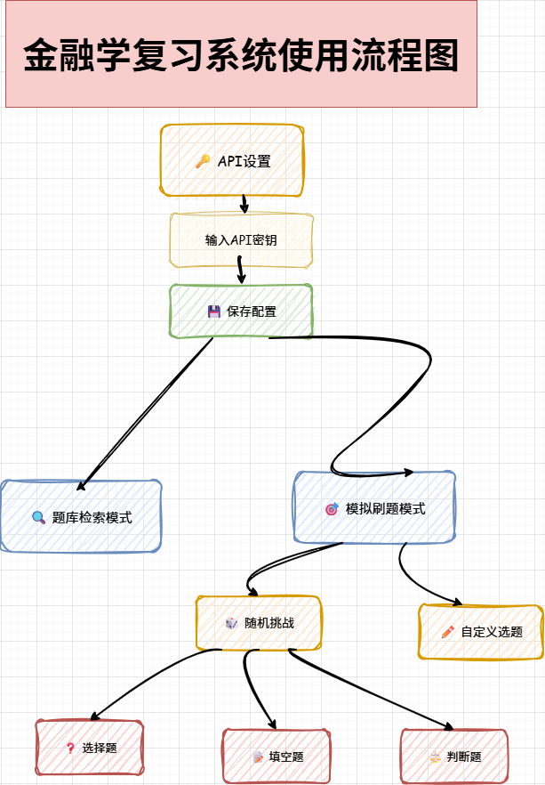
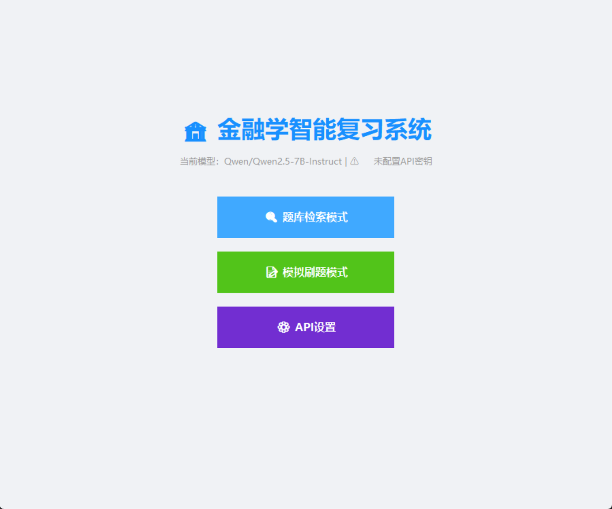
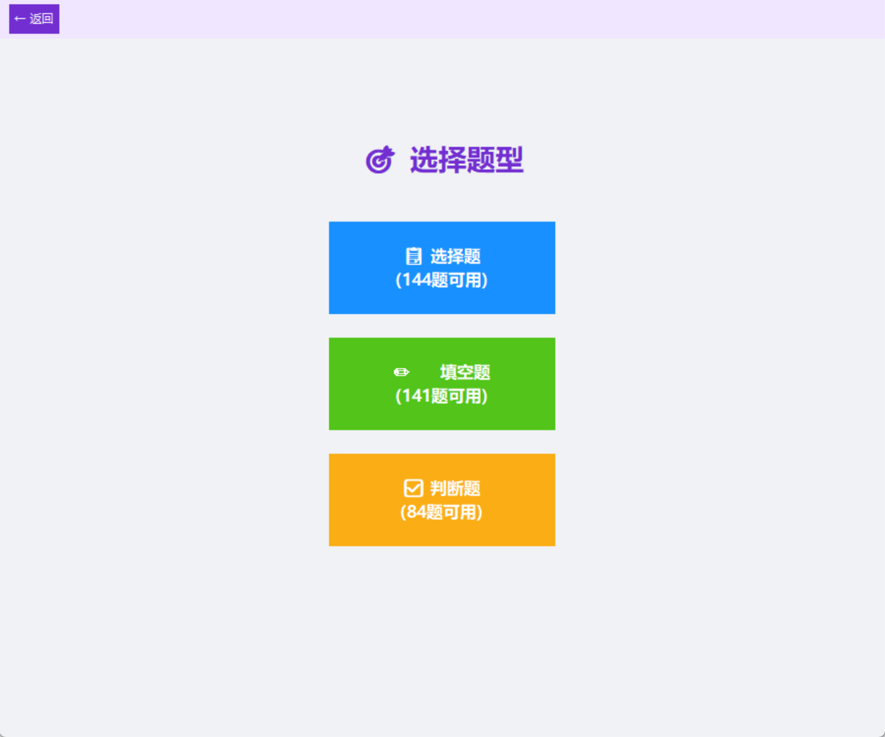
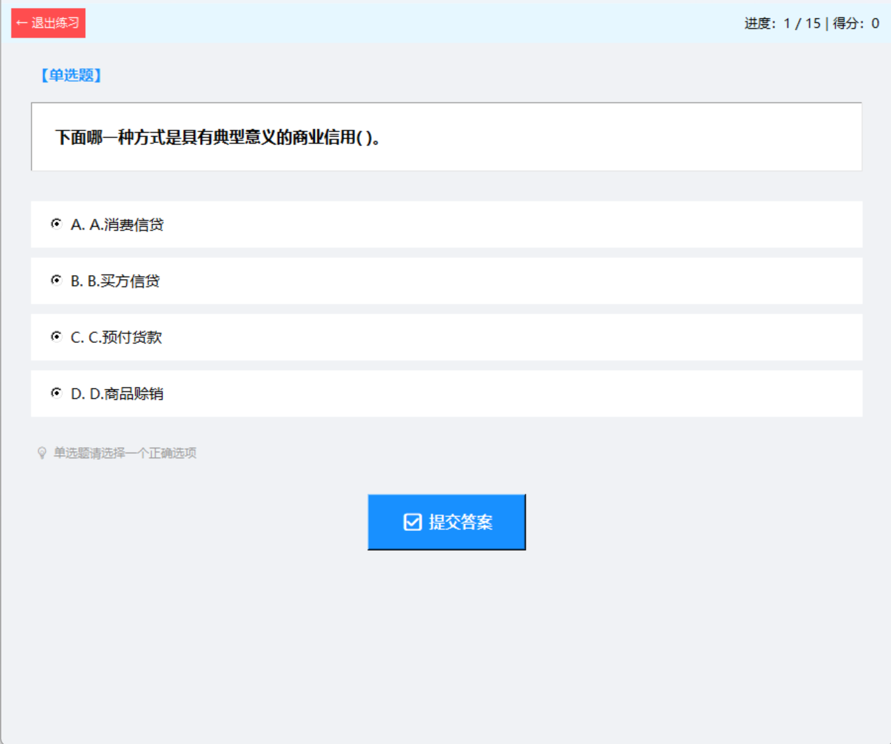
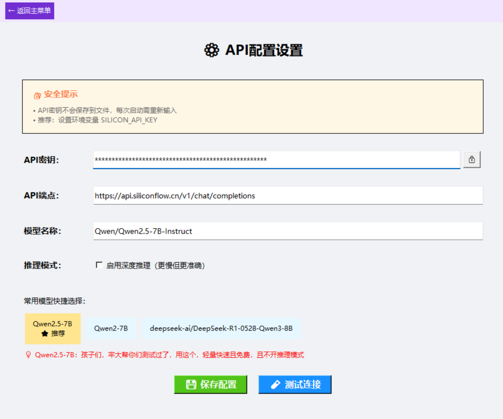
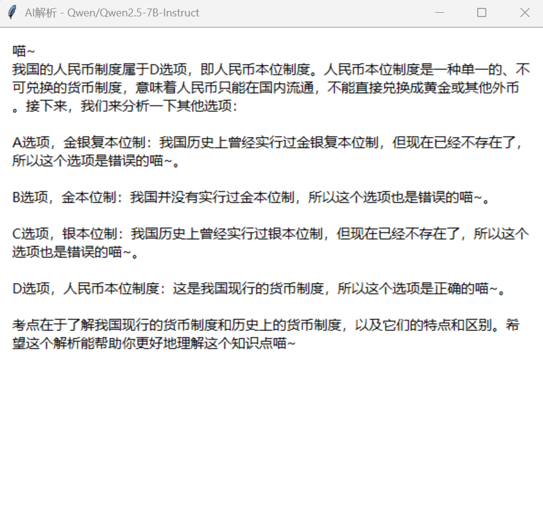

# 📖 金融学题库助手 (Finance Question Bank)

> 🎓 专为金融学学习通课程打造的智能刷题与复习工具，期末复习的好帮手！


---

## ✨ 功能特点

🔍 **智能检索**
- 题库关键词搜索，支持模糊匹配
- 快速定位目标题目

🎲 **随机刷题**
- 随机抽取题目，模拟真实刷题体验
- 告别机械式顺序刷题

📝 **模拟考试**
- 仿真考试环境，如临考场
- 支持自定义选题组卷

📂 **题型分类**
- 选择题、填空题、判断题分类管理
- 针对性练习薄弱题型

🤖 **AI 智能解析**
- 接入 Qwen、Deepseek 等 AI 大模型
- 一键获取题目详细解析
- 理解原理，不只是背答案

📊 **高效复习**
- 智能复习提醒
- 错题自动收集
- 期末复习效率倍增

---

## 使用流传
<p align="center">
  
</p>

 ---

## 📸 软件截图

<p align="center">
  
</p>

---

## 🚀 快速开始

### 方式一：直接下载（推荐）

前往 [Releases](https://github.com/lmhstart/lmhstart_finance_review_system/releases) 下载对应版本：

| 系统 | 下载 | 说明 |
|:---:|:---:|:---:|
| Windows | [📦 下载 .zip](https://github.com/lmhstart/lmhstart_finance_review_system/releases/latest) | 解压后运行 .exe |
| macOS | [📦 下载 .zip](https://github.com/lmhstart/lmhstart_finance_review_system/releases/latest) | 解压后运行 .app |

### 方式二：从源码运行

```bash
# 克隆仓库
git clone https://github.com/lmhstart/lmhstart_finance_review_system.git
cd lmhstart_finance_review_system

# 安装依赖
pip install -r requirements.txt

# 运行程序
python tikumain_v3.0.py
```

---

## 📋 系统要求

| 项目 | 要求 |
|:---:|:---:|
| 操作系统 | Windows 10/11 或 macOS 10.14+ |
| 屏幕分辨率 | 1280 × 720 及以上 |
| 网络 | AI 解析功能需要联网 |

---

## 🛠️ 技术栈

- **开发语言**：Python 3.8+
- **GUI 框架**：PyQt5
- **数据库**：SQLite
- **AI 接口**：Qwen / Deepseek API
- **打包工具**：PyInstaller (Win) / py2app (Mac)

---

## 📖 使用说明

### 🔍 题目检索

1. 在搜索框输入关键词
2. 支持模糊匹配，输入部分内容即可
3. 点击搜索结果查看详情

---

### 🎲 随机刷题

<p align="center">
  
</p>

1. 选择想要练习的题型
2. 点击「开始刷题」
3. 系统随机抽取题目

<p align="center">
  
</p>

> ⚠️ 目前选择题题目显示存在 bug，忘记删除多余的字母选项了

---

### 📝 模拟考试

<p align="center">
  
</p>

1. 点击「刷题模式」
2. 可选择系统随机组卷或自定义选题
3. 开始答题，体验真实考场氛围

---

### 🤖 AI 解析

> ⚠️ 使用前需配置 API 密钥

<p align="center">
  
</p>

1. 在题目详情页点击「AI 解析」
2. 等待 AI 生成详细解答
3. 深入理解题目原理

<p align="center">
  
</p>

---

## ⚠️ 重要声明

```
⚠️ 本软件仅供学习交流使用

1. 题库内容来源于学习通平台，版权归原作者所有
2. 本软件不得用于任何商业用途
3. 未经作者书面许可，禁止二次分发、售卖或用于盈利目的
4. 使用本软件造成的任何后果由使用者自行承担

如有侵权，请联系作者删除
```

---

## 🤝 贡献与反馈

- 🐛 发现 Bug？请提交 [Issue](https://github.com/lmhstart/lmhstart_finance_review_system/issues)
- 💡 有新想法？欢迎 [Pull Request](https://github.com/lmhstart/lmhstart_finance_review_system/pulls)
- ⭐ 觉得好用？给个 Star 支持一下！

---

## 📄 许可证

本项目采用 [MIT License](LICENSE) 开源

**但请注意：禁止商业用途，详见上方声明**

---

## 👨‍💻 作者

**lmhstart**

- GitHub：[@lmhstart](https://github.com/lmhstart)
- Email：lawiet800@gmail.com

---

## 🙏 致谢

- 感谢学习通平台提供的学习资源
- 感谢所有测试和反馈的同学

---

<p align="center">
  <b>📚 祝各位期末考试顺利！</b>
</p>
